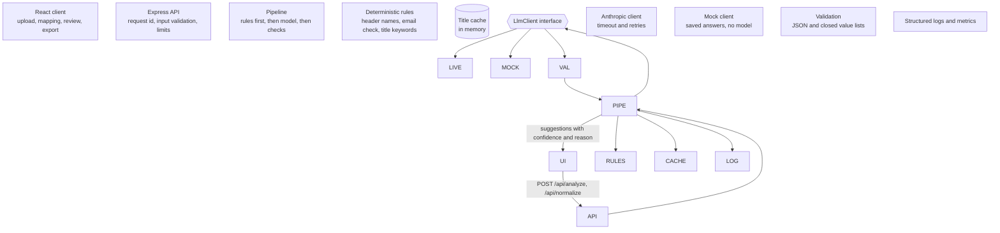

# Lead intake assistant

An AI assisted workflow for a marketing operations team: upload a raw lead file, review the
suggestions the system is unsure about, export a clean file that is ready to load into a marketing
automation platform.

## Quick start

Requires Node.js 20 or newer.

```bash
npm install
npm run dev
```

Open http://localhost:5173 and click **Use the sample file**.

With no API key the app starts in **demo mode**, which costs nothing and needs no internet.
Demo mode is not an AI model. See "Two modes" below. To use a live model:

```bash
cp .env.example .env      # then set ANTHROPIC\\\_API\\\_KEY
npm run dev
```

Other commands:

|Command|What it does|
|-|-|
|`npm test`|Runs the 24 unit tests. No API key or network needed.|
|`npm run eval`|Scores job title classification against 50 labelled titles. Without a key it scores the rules only.|
|`npm run record`|Needs a key. Runs the sample file through the live model and saves the answers for demo mode.|
|`npm run build \\\&\\\& npm start`|Builds the client and serves everything from http://localhost:3001.|
|`npm run typecheck`|TypeScript check for server and client.|

## Two modes: live vs demo

The app runs in one of two modes. The badge at the top right of the screen always shows which.

||Live mode|Demo mode|
|-|-|-|
|How to get it|`ANTHROPIC\\\_API\\\_KEY` set in `.env`|No key, or `LLM\\\_MODE=mock`|
|Where AI answers come from|A real model, called over the network|A lookup in `fixtures/recorded.json`|
|Is a model running|Yes|No|
|Works on any file|Yes|Only on values that are in the saved answers|
|Cost|Per token, shown in the run details strip|None|
|Needs internet|Yes|No|

**Demo mode is not an AI model.** It is a test double: for each column header or job title it
looks up a saved answer by exact text. Anything it has no saved answer for gets no suggestion and
is marked "Needs you", which is the same path a real provider outage takes.

Why it exists:

* You can run the whole workflow without creating an API key or paying for anything.
* The tests and the demo do not depend on the network.
* It is a fallback if the connection fails.

What is the same in both modes: the rules, the validation of answers, the confidence threshold,
the review screen and the export. Only the source of the AI answers changes, behind the
`LlmClient` interface in `server/llm/`.

What demo mode cannot show: real model quality, real latency and real cost. The delay in demo
mode is a fixed 250 ms and the token counts are estimates.

The saved answers in `fixtures/recorded.json` are real model output. They were recorded on
8 October 2026 with `npm run record`, which runs `data/sample\\\_leads.csv` through the live
pipeline using `claude-haiku-4-5-20251001`. Only answers that came from the model are saved.
Columns and titles handled by rules are not, because the rules run the same way in both modes.

The recording is frozen at that date. A live run today can give slightly different answers,
confidence values or reasons.

## Customer context and value

**The customer I assumed.** A mid sized B2B company with a marketing operations team of 3 to
5 people. Every week they receive lead files from trade shows, webinars, content syndication
vendors and partners. Each source uses its own column names and its own idea of data quality.

**The pain.** Before a file can be loaded into the marketing automation platform, an analyst has
to rename columns, remove broken rows, and translate free text job titles into the seniority and
department values that lead scoring and routing depend on. For a 500 row file this is one to two
hours of careful, dull work. When it is rushed, bad records reach sales, leads are routed to the
wrong team, and trust in marketing data drops. When it is done properly, hot event leads wait days.

**The value.**

* **Time:** the analyst only looks at the rows the system is unsure about, not all of them.
* **Speed to lead:** a file can be loaded the day it arrives.
* **Consistency:** the same title gets the same classification every time, whoever processes the file.
* **Control:** anything below the confidence threshold waits for a person, and every rejected row
is listed with a reason that can be sent back to the vendor.

**Why AI at all.** Column mapping and job title classification have a long tail that rules cannot
cover: abbreviations, other languages ("Geschäftsführer"), informal titles ("DevOps Ninja"). A
language model handles that tail well. Everything that rules can do reliably is still done by rules.

## What the user does

1. **Upload** a CSV file as it was received.
2. **Check the column mapping.** Each source column is matched to a standard field (email, first
name, last name, company, job title, country, phone) or marked "do not import". The user sees
example values, who made the suggestion (rule or AI), the confidence and a short reason, and
can change any of it.
3. **Review flagged rows.** Rows with a clear job title are ready straight away. Rows where the AI
was not confident, or gave no answer, wait for an accept, edit or reject decision. Rows with a
missing or broken email are rejected automatically.
4. **Export** a clean file and a rejection report.

A run details strip at the bottom shows AI calls, wait time, tokens, estimated cost and how many
decisions came from rules, from the AI and from the user.

## Architecture



|Path|Purpose|
|-|-|
|`shared/schema.ts`|Target fields, allowed seniority and department values, shared types|
|`shared/csv.ts`|Export safety helper (spreadsheet formula injection)|
|`server/rules.ts`|Deterministic rules for columns, emails and job titles|
|`server/prompts.ts`|The two prompts, in one place|
|`server/validate.ts`|Checks on everything the model returns|
|`server/pipeline.ts`|Orchestration: rules, cache, batching, retries, fallback, cost tracking|
|`server/llm/`|Provider interface, the live Anthropic client and the mock client|
|`server/app.ts`|HTTP routes, request ids, error handling|
|`server/logger.ts`|JSON logs and process counters|
|`client/src/`|The three screens and the run details strip|
|`tests/`|Unit tests for rules, validation and the pipeline|
|`eval/`|Labelled titles and the accuracy script|
|`fixtures/`|Saved answers that demo mode replays. No model involved at run time|
|`data/sample\\\_leads.csv`|Synthetic demo file. All people and companies are made up|

The server is stateless. The client holds the parsed rows between the two steps and builds the
export files in the browser.

## Design decisions and trade offs

**1. Rules first, model second.** Rules are free, instant and predictable, so they run first. The
model only sees what the rules decline to answer. On the labelled set the rules handle 30 of 50
titles with no model call. Trade off: rules can be confidently wrong (see evaluation), and they
only know English keywords.

**2. Closed lists and server side validation.** The model must choose from fixed lists of targets,
seniorities and departments. The server validates every item, drops anything outside the lists,
and drops ids it never asked about. An invented value cannot reach the export. Trade off: the
taxonomy is rigid. "Product Manager" has no natural department here, so it lands in "Other".

**3. Confidence threshold with a human in the loop.** Suggestions below 0.8 (configurable) go to
review. The threshold is the main accuracy versus effort dial: higher means more rows to review
and fewer wrong values imported. Trade off: model confidence is self reported and not calibrated.
The evaluation script reports "auto accepted but wrong" for exactly this reason.

**4. Unique titles, batches and a cache.** Rows are reduced to distinct titles, sent in batches of
20 with at most 3 calls in flight, and answers are cached in memory. Trade off: bigger batches are
cheaper per title (the instructions are paid once per call) but slower per call and lose more when
one call fails. Each batch fails on its own, so one bad call never fails the file.

**5. Small, fast model by default.** This is short text classification, so the default is Claude
Haiku 4.5. The model is one environment variable. Trade off: a larger model may do better on rare
or foreign titles at several times the cost and latency. The evaluation script is how to decide.

**6. Send the minimum.** Title classification sends job titles only. Names, emails and phone
numbers never leave the server for that step. Column mapping sends header names and three example
values for columns the rules could not identify.

### Latency, cost and accuracy

|Lever|Latency|Cost|Accuracy|
|-|-|-|-|
|Rules before model|Fewer calls|Fewer calls|Rules can be wrong with high confidence|
|Deduplicate and cache titles|Much lower on real files|Much lower|No effect|
|Larger batch size|Fewer calls, each slower|Lower|Slight risk on very long batches|
|Higher concurrency|Lower wall time|No effect|No effect, but rate limit risk|
|Larger model|Higher|Higher|Likely better on the long tail|
|Higher review threshold|No effect|No effect|Fewer wrong auto accepts, more human work|

Measured on one live run of `npm run eval` on 8 October 2026, with `claude-haiku-4-5-20251001`
and the default prices in `.env.example`:

|Measure|Result|
|-|-|
|Titles sent to the model|20, in one batch|
|Tokens in / out|438 / 987|
|Cost|$0.0054, about $0.0003 per title|
|Latency of the call|about 6 seconds|

Output tokens are about 92% of the cost, and most of the output is the reason text. Shorter
reasons, or reasons only for low confidence answers, would be the first cost lever.

Extrapolated, a 2,000 row file with 400 distinct titles the rules cannot handle needs 20 batches:
about $0.11, and roughly 40 seconds with 3 calls in parallel. This is an estimate from a single
call, not a load test. I have not measured p95 latency.

## Failure modes

|What goes wrong|What the system does|What the user sees|
|-|-|-|
|Provider times out, rate limits or is down|SDK retries twice with backoff. If it still fails, that batch falls back.|A banner, and the affected rows marked "Needs you". Rule based rows are unaffected.|
|Model returns prose or broken JSON|One retry, then fallback for that batch.|Same as above.|
|Model returns a value outside the allowed lists|That item is dropped, the rest of the batch is kept.|That row is marked "Needs you".|
|Model is unsure|Row is routed to review.|Suggestion shown with its confidence and reason, editable.|
|Model is confidently wrong|Not caught automatically.|Visible only in the ready rows list. Measured by the evaluation script.|
|Two columns map to the same field|The more confident one wins, the other is set to "do not import".|Explained in the "Why" column. Confirm is blocked while duplicates remain.|
|No email column mapped|Confirm is blocked.|A message saying what to fix.|
|File is not a CSV, is empty or is too large|Rejected with a 400 or 413.|A message saying what to do.|
|File contains text that tries to instruct the model|Treated as data. Output is limited to closed lists.|Nothing unusual.|
|File contains spreadsheet formulas|Cells are neutralised on export.|Nothing unusual.|
|Server is unreachable|Client catches the network error.|A message with the next step.|

## Testing and evaluation

**Unit tests** (`npm test`, 24 tests) use a scripted fake model, so they are fast and need no
network. They cover the behaviour that matters most:

* rules map clear cases and decline ambiguous ones
* the model is only asked about what rules could not handle, once per distinct title
* malformed output triggers one retry
* provider failure degrades to human review without losing rows
* failures are isolated per batch
* invented values, out of range confidence, unknown ids and duplicate ids are dropped
* cost is computed from token usage
* export neutralises formulas but leaves phone numbers intact

**Evaluation** (`npm run eval`) scores job title classification against `eval/titles.json`,
50 hand labelled titles including abbreviations, other languages and deliberately awkward cases.

Measured with a live key on 8 October 2026 (`claude-haiku-4-5-20251001`, review threshold 0.8):

|Metric|Rules only (no key)|Rules plus model|
|-|-|-|
|Titles answered|30 of 50|50 of 50|
|Accuracy when answered|97% (29 of 30)|92% (46 of 50)|
|Model accuracy on the 20 titles rules left||85% (17 of 20)|
|Auto accepted without review|30|47|
|Auto accepted but wrong|1|3|

The 4 wrong answers:

|Title|Expected|Got|Confidence|Caught by review|
|-|-|-|-|-|
|Network Engineer (rule)|IC / IT|IC / Engineering|0.95|No|
|Chief Technology Officer|C-Level / Engineering|C-Level / IT|0.99|No|
|Leiter Vertrieb|Director / Sales|Manager / Sales|0.85|No|
|Legal Counsel|IC / Other|Manager / Other|0.70|Yes|

What this shows:

* The review threshold caught only one of the four errors. The CTO answer was wrong at 0.99
confidence, which confirms that self reported confidence is not calibrated
* Two of the errors are arguable labels rather than clear mistakes: a CTO can sit in IT, and
"Leiter" can mean either head or manager. The labels are one person's judgment
* The cost of an error is low here: seniority and department feed lead scoring and routing, and
a wrong department sends a lead to the wrong team rather than losing it
* The rule error is left in on purpose. Keyword rules answer with a fixed high confidence even
when they are wrong, so they need the same evaluation as the model.

## Observability

* **Structured logs.** One JSON line per event on stdout. Every request has a `requestId` that
appears on all its lines.
* **Per model call:** task, model, attempt, item count, valid and dropped items, latency, input and
output tokens, cost.
* **Per failure:** whether it was the provider or invalid output, with the message.
* **Per run:** totals returned to the client and shown in the run details strip.
* **Process counters:** `GET /api/metrics` (requests, calls, failures, tokens, cost, average latency).
* **Health:** `GET /api/health` reports the mode and model.

To troubleshoot "this file gave odd results", find the `requestId` in the `http\\\_request` line and
filter the log by it. `dropped` above zero means the model returned values outside the allowed
lists. `llm\\\_call\\\_failed` shows whether the provider or the output format was at fault.

Lead data is not written to the logs, only counts and timings.

## Performance and scalability

The model call is the bottleneck. Parsing and rules take milliseconds. A model call takes seconds.

Wall time is roughly `ceil(distinct unknown titles / batch size / concurrency) x call latency`.

What I would measure: p50 and p95 latency per call, tokens per title, the share of titles handled
by rules and cache, the fallback rate, and the share of rows sent to review. All of these are
already in the logs.

How it would scale:

1. **More titles per file:** raise concurrency within the provider rate limit. For non urgent
files, use the provider batch API at lower cost.
2. **More files and users:** move processing to a job queue with workers, store uploads and
results, and stream progress to the client. The request and response design here will not
survive files that take minutes.
3. **Repeat work:** replace the in memory cache with a shared store. Titles repeat heavily across
files, so the cache hit rate should climb over time and cost per file should fall.
4. **Learning from reviewers:** store accepted and edited decisions and use them as the first
lookup. Human corrections become rules for free.

## Security and privacy

* The API key stays on the server and is read from `.env`, which is not committed.
* Uploaded content is untrusted. It is passed to the model as JSON data with an instruction not to
follow anything inside it, and output is limited to closed lists.
* Only job titles are sent for classification. Column mapping sends header names and up to three
example values for unidentified columns, which can include personal data. See limitations.
* Exported cells that start with a formula character are neutralised.
* There is no authentication. This is a local demo.

## Assumptions

* Files are CSV, UTF-8, with a header row, up to 2,000 rows and 5 MB.
* The target schema has seven fields. A real customer would have their own.
* Email is the only required field.
* Seniority and department taxonomies are fixed and small.
* One user at a time, on a trusted machine.
* Sending job titles to a third party model provider is acceptable to the customer.

## Known limitations and what I left out

|Left out|Why|
|-|-|
|Deduplication, enrichment, loading into the platform|Each is a project of its own. The slice ends at a clean file.|
|Country, phone and company normalisation|Same pattern as job titles. One example of the pattern was enough to show the design.|
|Excel files|CSV keeps parsing simple.|
|Persistence, sessions, audit trail|Stateless by design for the demo. A refresh loses the review.|
|Progress streaming|The UI shows a busy state. Large files would need real progress.|
|Bulk accept in review|Deliberate. It invites rubber stamping. A real version needs it with safeguards.|
|Editing a broken email in the UI|Invalid rows go to the rejection report.|
|Authentication and access control|Local demo.|
|Masking personal data in column samples|Would be required before real use.|
|Calibrated confidence|The threshold uses self reported confidence. A real version would calibrate it against labelled data.|
|Provider failover|The interface allows a second provider. Only one is implemented.|

honest weaknesses:

* Demo mode is a lookup, not a model, so it only works on the sample file.
* The rules are English only and can be confidently wrong.
* The cache never expires and is lost on restart.
* The labelled set is small and was labelled by one person.

## Possible extensions

* **Second provider or a local model:** implement `LlmClient` in one new file.
* **Learning loop:** store reviewer decisions and consult them before rules.
* **More fields:** add a target to `shared/schema.ts`, a prompt and a schema.
* **Saved mappings per source:** save confirmed mappings per vendor so repeat files need no
mapping step.
* **Direct load:** push the clean file to the marketing automation platform API.
* **10x traffic:** queue, workers, shared cache, batch API, as described above.

## Use of AI

**In the product.** The model does two things: suggests a mapping for columns the rules could not
identify, and classifies job titles the rules could not classify.

**Where the product deliberately does not use AI.**

* Email validation, known header names and clear job titles are handled by rules. They are cheaper,
faster and predictable.
* The model never decides whether its own output is acceptable. Validation and the confidence
threshold are plain code.
* Answers below the confidence threshold wait for a person. Answers above it are imported
without review, and the evaluation shows that 3 of 47 of those were wrong.
* Export is deterministic.

**In building it.** I used Claude (Anthropic). It proposed the back end based on the use case I
chose. It wrote most of the code, made the synthetic sample file, the first version of the
evaluation labels and the first draft of this README.

**Where I did not rely on AI.**

* Choosing the use case, judging whether the customer context is realistic, the architecture of
the workflow, and diagramming the solution
* Running the app in live mode, recording the demo answers and running the evaluation. All
numbers in this README come from runs I did
* Checking the README against what the code really does

